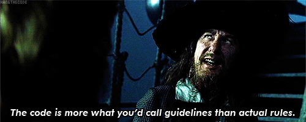

# Videcom

> This document was created based on lessons learned from working with the Videcom API. There is a good bit of "camp fire knowledge" here and knowledge developed through inference and deduction.

> Much like the Pirates Code, it is correct to think of this document as more of a set of "guidelines" than actual rules.



## Connecting

### Endpoints

Each airline has it's own unique endpoint defined by the pattern below:

```
# TEST
https://customertest.videcom.com/${airlineName}/vars/public/webservices/VRSXMLWebservice3.asmx

# PROD
https://customer.videcom.com/${airlineName}/vars/public/webservices/VRSXMLWebservice3.asmx
```

In this URL, the `${airlineName}` is the name of the airline as assigned by Videcom.

#### Commands via XML - `?op=RunVRSCommand`

This endpoint allows you to submit commands as though you were typing them out at the Videcom-supplied command line interface. Each command is wrapped in an XML payload.

```xml
<soap12:Envelope xmlns:xsi="http://www.w3.org/2001/XMLSchema-instance" xmlns:xsd="http://www.w3.org/2001/XMLSchema" xmlns:soap12="http://www.w3.org/2003/05/soap-envelope">
  <soap12:Body>
    <msg xmlns="http://videcom.com/">
      <Token>${token}</Token>
      <Command>${command}</Command>
    </msg>
  </soap12:Body>
</soap12:Envelope>
```

The `${token}` value is provided by Videcom and is associated with the `${airlineName}` and source IP that your application is using.

The `${command}` value is the same as the command that you might otherwise type into the Videcom command line interface.

#### Commands & XML via SOAP - `?WSDL`

This endpoint provides a WSDL that can be used by SOAP clients to construct both standard Videcom commands and submissions to their XML API.

It's recommended that you use the `VrsXmlWebService3.VrsXmlWebService3Soap12` branch of the SOAP API. This branch has two methods that are particularly useful:

1. `RunVRSCommand` - Equivalent to the `?op=RunVRSCommand` endpoint.
2. `RunVRSCommandXml` - Allows you to submit XML payloads. Mainly for flight scheduling. See `VRS XML Flight Schedule.doc` for more detailed information about some of the XML payload options.

### Authentication

There are two layers of authentication:

1. Source IP validation.
2. Payload token validation.

#### Source IP Validation

Videcom requires that you register the source IP address for each application that is going to interact with their API. Each IP must be associated with the endpoint that it will interact with. You will have to provide the sine code when you request adding an IP address.

Both the `RunVRSCommand` and `WSDL` endpoints perform this validation.

#### Payload Token Validation

If you are interacting with the `?op=RunVRSCommand` endpoint or the `RunVRSCommand` SOAP method, you will need to provide a Videcom-supplied token to authenticate your request.

The token may be the same for multiple endpoints/airlines.

### Error Codes

- `101` - Not HTPPS
- `102` - No token
- `103` - Invalid token
- `104` - Invalid agent sine
- `105` - No IP configured for agent
- `106` - Invalid IP
- `107` - ApiIpAddress missing from agent table


## Videcom Commands

A Videcom command is defined as a string of characters that are interpreted by the Videcom systems to perform a specific action. While a single string performs a specific action, you can concatenate multiple strings together using a carat (`^`).

When interacting with the Videcom command API, it's correct to think of submitting each request as being the same as pressing the `Enter` key at the command line.

Videcom provides some documentation for it's command-line interface - http://manuals.videcom.com/interfaces/commands/all-commands/list-of-all-commands/
To access this documentation, you'll need to log in with the password of `videcom`.

### Multiple Command Concatenation

When you need to execute multiple commands in a single PNR context, you should concatenate the individual commands with a carat `^`. Look at the sample booking command below for an example of what this looks like.

If a command is concatenated, the order of the commands will affect the success of the command as a whole. For example, if you try to add contact information for a passenger before you have defined the passenger, the command will fail.

### Booking a Flight

#### Sample Concatenated Command

```
-Doe/John#^9-1E*johndoe@example.com^9-1M*555-867-5309^3-1FDOB 17NOV44^3-1FGNDR Male^-Doe/Jane#^3-2FDOB 21DEC46^3-2FGNDR Female^09X0157M27JulMGWPITNN2^FG^FS1^3-1fpwgt 172^4-1FDOCO//K/987654320///USA^3-2fpwgt 135^4-2FDOCO//K/987654321///USA^*R^MKUSD88.00/123456xxxxxx7890**0120^EZT*R^EZRE^*R~x
```

#### Command breakdown

##### Creating a passenger

```
-Doe/John#
```

This is passenger #1 because it was the first passenger identified. Template is:

```
-${lastName}/${firstName}#
```

##### Adding passenger contact information

```
9-1E*johndoe@example.com
```
This is passenger #1's email contact information. The template for this command is:

```
9-${passengerNumber}E*${passengerEmail}
```

```
9-1M*555-867-5309
```

This is passenger #1's mobile number. The template is:

```
9-${passengerNumber}M*${passengerPhoneNumber}
```

Valid options for type of contact information include:

- `B` - Business contact number
- `T` - Travel agency information
- `H` - Home phone number
- `M` - Mobile phone number
- `P` - Other phone number
- `A` - Home address
- `C` - Credit card address
- `E` - Email address

##### General passenger information

```
3-1FDOB 17NOV44
```
This is passenger #1's date of birth. Template is:

```
3-${passengerNumber}FDOB ${passengerDoB}
```

Valid options include:

- `FGNDR` - Passenger gender: `Male`, `Female`
- `FPWGT` - Passenger weight (in pounds): `172`
- `FDOB` - Passenger date of birth: `24MAY81`

##### Flight information

```
09X0157M27JulMGWPITNN2
```

Breakdown:

- `0` - Standard prefix that tells Videcom that you want to sell seats on the flight that you are about to specify.
- `9X0157` - Flight identifier, `9X` = the airline prefix, `0157` the flight number.
- `M` - Seating class identifier
- `27Jul` - The date of departure (`DDMMM`).
- `MGWPIT` - The IATA code for departure (`MGW`) and arrival (`PIT`).
- `NN` - Actually sell, don't just quote the price (`QQ`)
- `2` - The number of ticketed passengers

##### Airport information

```
4-1FDOCO//K/987654321///USA
```

This example is the "US Known Traveler Number". Template is:

```
4-${passengerNumber}FDOCO//${docType}/${docDetails}
```

Valid `${docType}` and `${docDetails}` include:

- *DHS Redress Number*
  - Document type = `R`
  - Document details = `12345///USA` (`/I` for infant)
- *US Known Traveler Number*
  - Document type = `K`
  - Document details = `12345///USA` (`/I` for infant)
- *Visa information*
  - Document type = `V`
  - Document details = `9891555/LONDON/14MAR06/USA`
    - `9891555` = Visa number
    - `LONDON` = Place of issue
    - `14MAR06` = Date of issue
    - `USA` = Country where visa applies

##### Fare Commands

```
FG
```

This is the *Fare Quote* command. It essentially creates a list of fares from which you can select one to sell by issuing an `FS${number}` command.

```
FS1
```

This is the *Fare Store* command. Issuing this command immediately after the `FG` command will sell from the *Fare Quote* list whichever fare is specified by the `${number}`.

##### Diaplay Commands

```
*R
```

This command will "save" the information you've entered so far and and return the PNR context making it possible to assign tickets to the PNR.

##### Payment Information

```
MKUSD88.00/123456xxxxxx7890**0120
```

This command tells Videcom how to process the payment for the booking. Template is:

- `MK` - Prefix identifying payment information.
- `USD` - Currency identifier.
- `88.00` - The cost of the tickets in whatever currency is specified.
- `/` - separator
- `123456xxxxxx7890` - The credit card number,
- `**` - separator
- `0120` - Credit card expiration date (`MMYY`).

##### Ticketing

```
EZT*R
```

This command tells Vidcom to issue the E-Ticket for all pax on all segments, finalize the transaction and return the PNR context (`*R`).

##### Email confirmation

```
EZRE
```

This command tells Videcom to send confirmation emails to the address specified in the CTCE field (`9-${passengerNumber}E*${passengerEmail}`).

##### Return format

```
~x
```

Appending this to the command tells Videcom that you expect a response in XML format.
